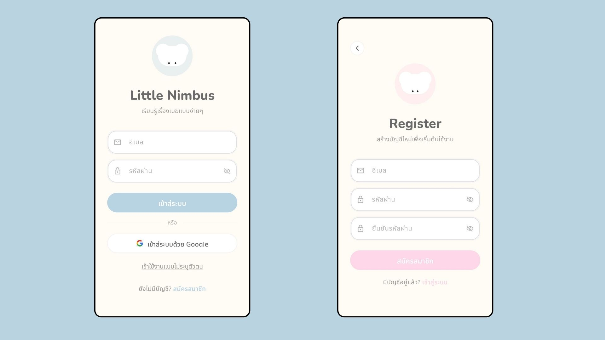
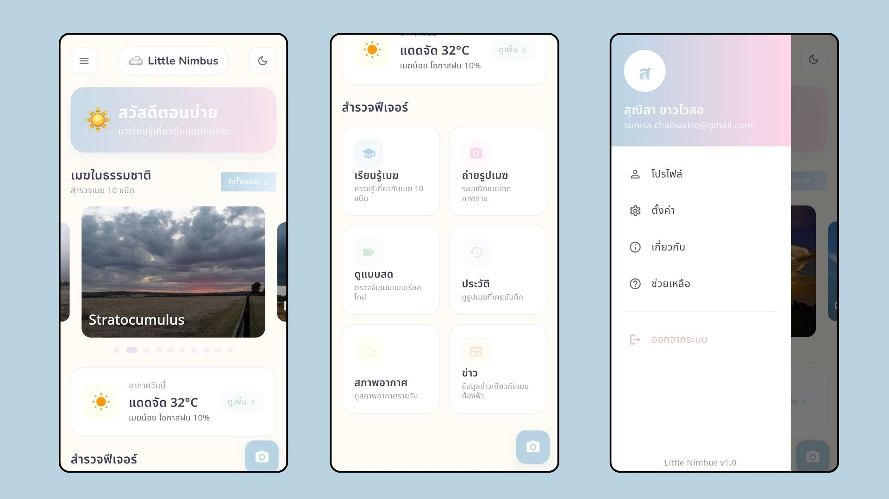
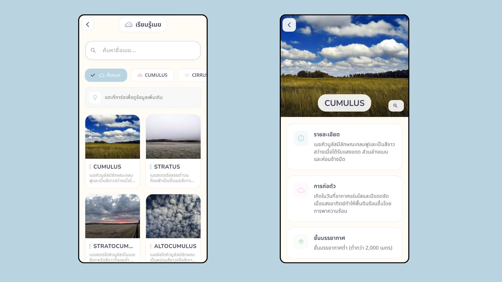
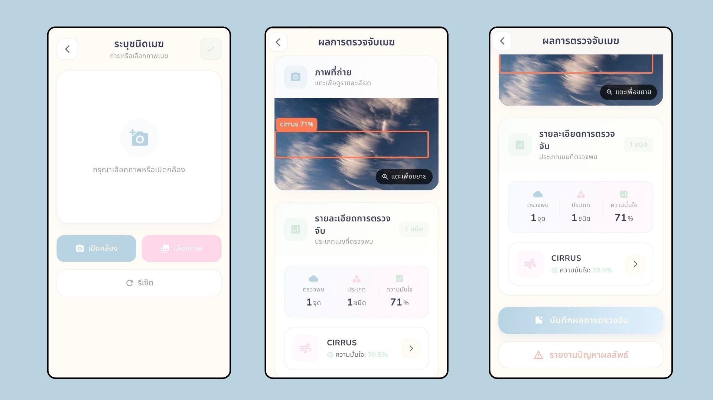
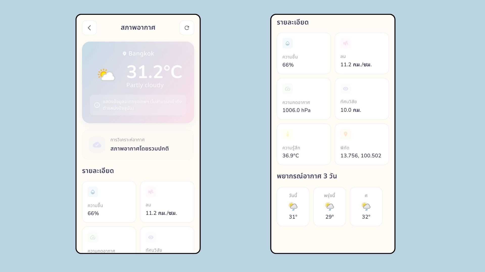
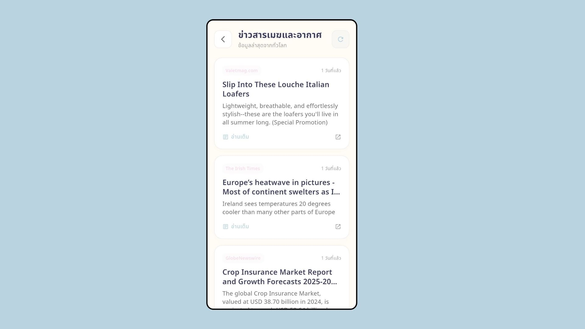
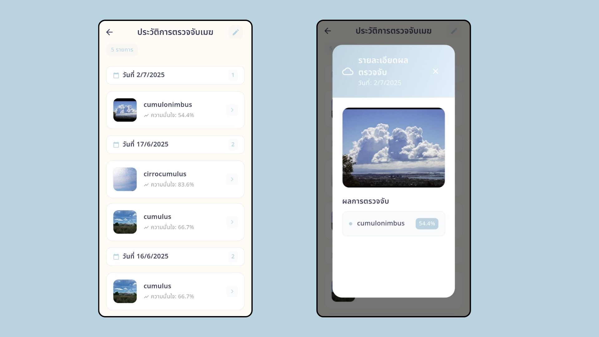
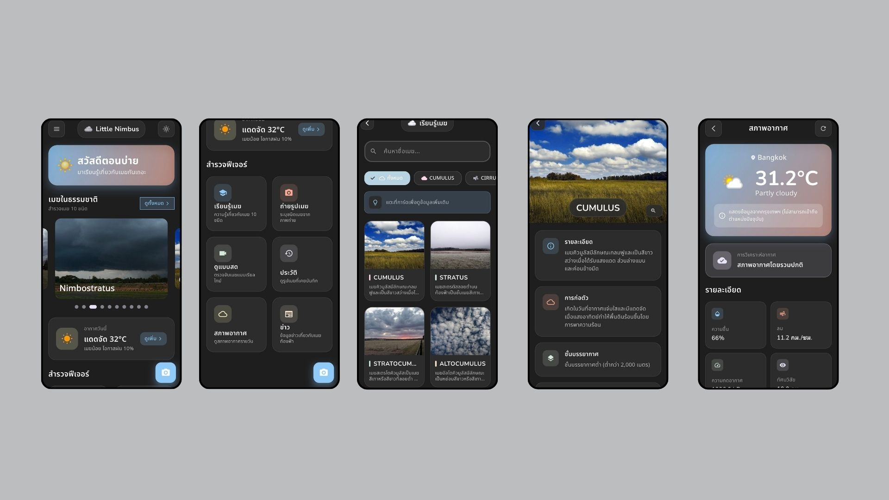
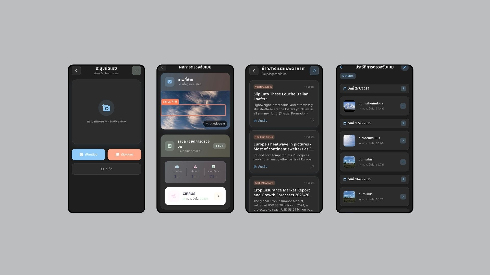

# 🌥️ Little Nimbus – Cloud Detection App  

แอปพลิเคชันตรวจจับและจำแนกประเภทเมฆจากภาพถ่าย ด้วยโมเดล **YOLOv8** และ **Flutter**  
พัฒนาเพื่อช่วยในการเรียนรู้เมฆและใช้ประกอบการพยากรณ์อากาศเบื้องต้น  

---

## ✨ Features
- 📸 ตรวจจับเมฆจากกล้องหรืออัปโหลดภาพ  
- 🔍 จำแนกเมฆได้ 10 ประเภท  
- 💾 บันทึกประวัติการตรวจจับ (สำหรับผู้ใช้ที่ล็อกอิน)  
- 🌗 รองรับ Light / Dark Theme   
- 📖 แสดงข้อมูลประกอบการเรียนรู้เกี่ยวกับเมฆ  

---

## 🛠️ Tech Stack
- **Mobile:** Flutter (Dart)  
- **AI Model:** YOLOv8 → TensorFlow Lite  
- **Backend/Database:** Firebase Authentication, Firestore, SQLite  
- **Design:** Material Design + Pastel Theme  

---

🚀 Installation & Run

Clone repository

git clone https://github.com/mellomxnt/little-nimbus-app.git
cd little-nimbus-app

ติดตั้ง dependency

flutter pub get

รันแอป

flutter run

⚠️ หมายเหตุ: ต้องเพิ่ม google-services.json (Firebase) ในโฟลเดอร์ /android/app/ 

📸 Screenshots

📑 Model

YOLOv8 model ที่เทรนด้วยชุดข้อมูลเมฆ 10 ประเภท

แปลงเป็น TensorFlow Lite เพื่อใช้งานบนมือถือ

ดาวน์โหลดโมเดล: (https://drive.google.com/file/d/13QI8RvBespSW0rtimjbem-BE9rzsk8eB/view?usp=sharing)

👤 Author

พัฒนาโดย: Krisanar Chaowaiso